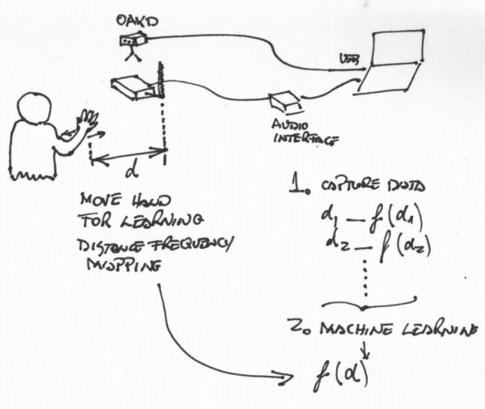
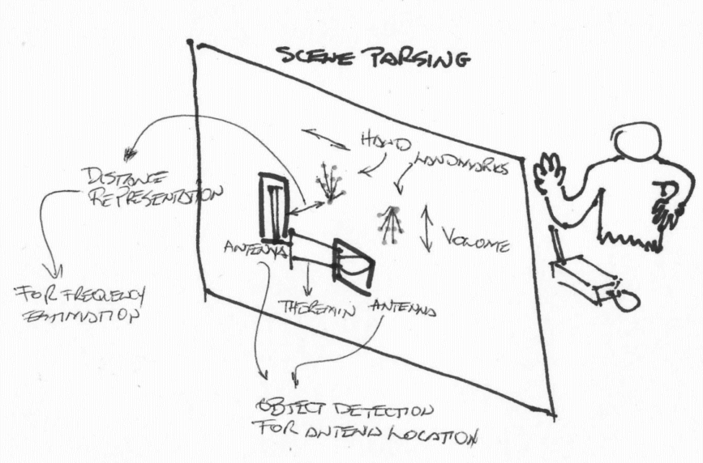
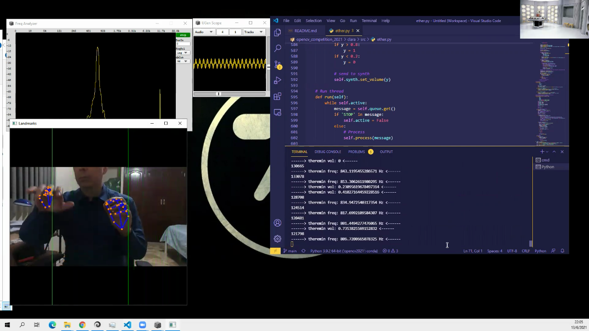

# Project Clara - OpenCV 2021 Competition
## Team Clara
+ Elisa Andrade
+ Jorge Chong

---
## Description
The theremin is an electronic musical instrument invented by Leon Theremin in 1920. It has two antennas, one for volume and one for tone. The tone of the apparatus is the result of a process of heterodynization of a signal at a reference frequency with a variable frequency oscillator, whose frequency depends on the distance from the hand to the tone antenna. One of the difficulties of learning the theremin is that there is no direct cue about which position of the hand produce a specific note. For example instruments like the piano or the guitar provide physical and visible feedback on the notes to be played. In the Theremine the only feedback provided is the tone produced. 

We propose the use of computer vision through the OAKD device in order to provide assited learning and playing for the theremin. As seen on the picture, the OAKD device should be used to parse the scene in front of the user. This scene should contain the player and the theremin. Using a model for Hand Landmark Detection, it will follow the hand gestures as the player tries to play the instrument. Using Object Detection the system should establish the position of the theremin as a reference with respect to which we do distance measurements using Depth Estimation.

The project has 4 subsystems that use computer vision models:

+ Theremin Simulator.
+ Calibration: Tone function.
+ Calibration: Body and Theremin location.
+ Assisted Practicing System.

---
## Components

### 1. Theremin Simulator

The simulator is a proof of a concept in order to test the capabilities of the OAKD in terms of inference using deep learning models. For example we used the implementation by [Geax Hand Tracking](https://github.com/geaxgx/depthai_hand_tracker) of the Mediapipe Hands model for hand tracking. 

### 2. Calibration: Tone Function

The mapping between the right hand and the tone antenna is not a linear mapping. So using a bit of machine learning we can do some measurements in order to map hand distnace to frequency. Distance should be estimated using computer vision. The figure shows a possible configuration. This will require some way to capture audio produced by the theremin and input it to the calibration program.

&nbsp;


&nbsp;

### 3. Calibration: Body and Theremin Location

A second calibration procedure is necessary for establishing an anchoring of the Theremin body and parts (antennas), as well as the body position of the player. This is necessary in order to estimate distance of the hand to the tone antenna.

### 4. Assisted Practicing System

This would be a system that provides hints where to place hands and finger configuration in order to play the next note. Similar to systems like [Synthesia](https://synthesiagame.com/) for the piano. This requires parsing of the scene using a video capture device with Computer Vision capabilities like the OAKD. As depicted the parsing of the scene requires detection and location of the Theremin antenna as well as location of the hands. Ideally hand tracking and landmarks location is necessary for a fine detailed estimation of the tone. Another subsystem will read a music score file and guid the player for the next note.

&nbsp;


&nbsp;


---
## Status
Due to some logistic problems (we haven't gotten a Theremin yet), we have manage to use the OAKD device for input as a hand tracking device and we have implemented the Theremin Simulator. This exercise was necessary in order to test and realize the difficulties we were going to have. This is a work in progress and currently we wanted to test the capabilities of the platform.

### Theremin Simulator
Our simulator is in ```ether.py```. In this version we only use hand landmark locations detected by neural networks which are sent to the OAKD device. The models are located in ```src/models```.

The original idea was to add depth estimation to locate hand position in relation to the antenna positions. At the moment we are having problems integrating depth with the hand tracking models. Our theremin simulator uses 2 XLinkIn nodes and 3 XLinkOut nodes. This is necesary because we use two neural networks (one for palm detection and the other for landmark locations). If we add depth and spatial calculator nodes it crashes. Nonetheless we are doing some experiments (see ```test_ether_and_depth.py```). 

UPDATE: we are making some progress integrating a palm detector and send the palm ROIs to the depth calculator. A rough test is in ```ether_palm_depth.py```. A further update will include a test of using depth to calculate the distance between an anchor ROI (possibly center of torso) with right hand palm to test the tone control in a similar fashion of ```ether.py```.

What we have found so far is that maybe using CV to make a model for the relationship between tone and distance to antenna is a hard problem. There are two problems: first, the resolution is not very precise and second, the location of hand landmarks make a very noise or too variable reading (further filtering can alleviate this). In the next figure we see a screen capture of ```ether.py``` sending data to Supercollider.

&nbsp;

&nbsp;


---
## Source Code
### Requirements

+ Depthai (https://luxonis.com/depthai)[https://luxonis.com/depthai]
+ Python OSC Library (https://pypi.org/project/python-osc/)[https://pypi.org/project/python-osc/]
+ Supercollider 

### 1. Theremin Simulator

In source code directory, the script ```ether.py``` implements a simple Theremin Simulator. At the moment we have not figured out how to start the synthesizer in Supercollider from python. So you have to do it manually.

Open ```ether.scd``` in Supercollider. After booting the server in line 3. Execute ```NetAddr.langPort;``` and copy the ip address and port.

Start ```ether.py``` with these parameters:
```sh
ether.py --scserver [IPADDRESS] --scport [PORT]
```


