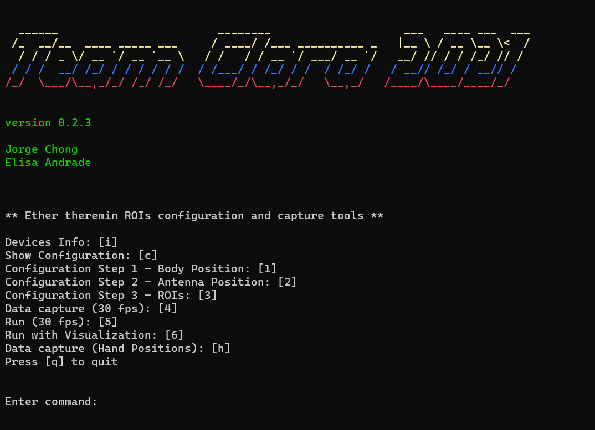
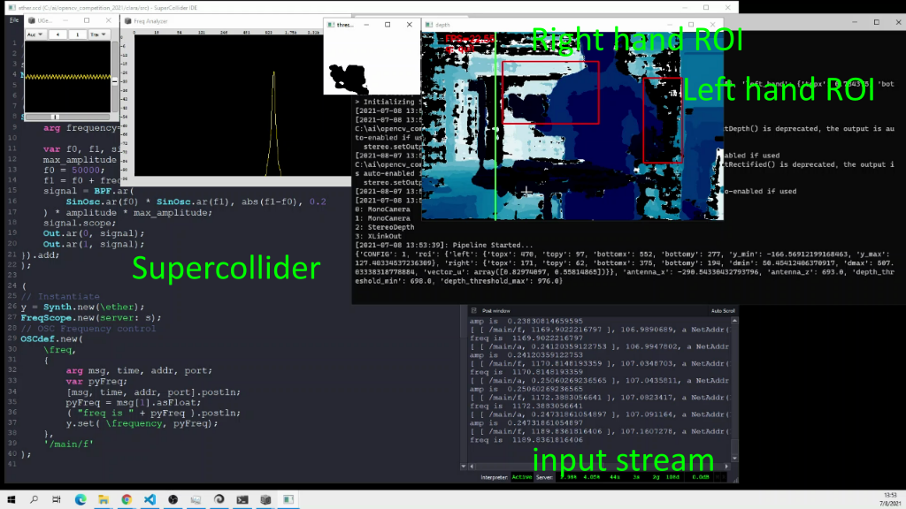

# Project Clara - OpenCV 2021 Competition
## Team Clara
+ Elisa Andrade
+ Jorge Chong

---
## Description
The theremin is an electronic musical instrument invented by Leon Theremin in 1920. It has two antennas, one for volume and one for tone. The tone of the apparatus is the result of a process of heterodynization of a signal at a reference frequency with a variable frequency oscillator, whose frequency depends on the distance from the hand to the tone antenna. One of the difficulties of learning the theremin is that there is no direct cue about which position of the hand produce a specific note. For example instruments like the piano or the guitar provide physical and visible feedback on the notes to be played. In the Theremine the only feedback provided is the tone produced. 

We propose the use of computer vision through the OAKD device in order to provide assited learning and playing for the theremin. As seen on the picture, the OAKD device should be used to parse the scene in front of the user. This scene should contain the player and the theremin. Using a model for Hand Landmark Detection, it will follow the hand gestures as the player tries to play the instrument. Using Object Detection the system should establish the position of the theremin as a reference with respect to which we do distance measurements using Depth Estimation.

The project has 4 subsystems that use computer vision models:

+ Theremin Simulator.
+ Calibration: Tone function.
+ Calibration: Body and Theremin location.
+ Assisted Practicing System.

**UPDATE [2021/06/20]**: We are following a completely different approach. Thanks to another project from which we got inspired. See this project [American Sign Language using Hand Landmarks](https://github.com/cortictechnology/hand_asl_recognition/). We are building a midi reader, an interface for playing and more importantly a dataset for hand gestures.

**UPDATE [2021/07/31]**: We finally came out by a solution for a simulator using depth directly.

---
## Components

### 1. Theremin Simulator

The simulator is a proof of a concept in order to test the capabilities of the OAKD in terms of inference using deep learning models. For example we used the implementation by [Geax Hand Tracking](https://github.com/geaxgx/depthai_hand_tracker) of the Mediapipe Hands model for hand tracking. This turned out to be a wrong approach. Instead we use depth frames generated by the OAK-D device.

### 2. Calibration: Tone Function

The mapping between the right hand and the tone antenna is not a linear mapping. So using a bit of machine learning we can do some measurements in order to map hand distnace to frequency. Distance should be estimated using computer vision. The figure shows a possible configuration. This will require some way to capture audio produced by the theremin and input it to the calibration program.

&nbsp;


&nbsp;

### 3. Calibration: Body and Theremin Location

A second calibration procedure is necessary for establishing an anchoring of the Theremin body and parts (antennas), as well as the body position of the player. This is necessary in order to estimate distance of the hand to the tone antenna.

### 4. Assisted Practicing System

This would be a system that provides hints where to place hands and finger configuration in order to play the next note. Similar to systems like [Synthesia](https://synthesiagame.com/) for the piano. This requires parsing of the scene using a video capture device with Computer Vision capabilities like the OAKD. As depicted the parsing of the scene requires detection and location of the Theremin antenna as well as location of the hands. Ideally hand tracking and landmarks location is necessary for a fine detailed estimation of the tone. Another subsystem will read a music score file and guid the player for the next note.

&nbsp;


&nbsp;


---
## Status
Due to some logistic problems (we haven't gotten a Theremin yet), we have manage to use the OAKD device for input as a hand tracking device and we have implemented the Theremin Simulator. This exercise was necessary in order to test and realize the difficulties we were going to have. This is a work in progress and currently we wanted to test the capabilities of the platform.

**UPDATE [2021/07/31]**: We finally set our hands on a Theremini and started experimented with it.

### Theremin Simulator

We have two simulators: ```ether_demo.py``` and ```ether.py```. Both versions used the depth stream by the OAK-D. Frame rate can be set by a command line option. Though we have found that in our computer they do not run at 120 fps. ```ether_demo.py``` is a multi threaded version.

Sound generation is done by streaming parameters to a Supercollider script ```ether.scd```. We have not find a way to make it start and stop the synthesizer.

In order to work correctly, a configuration step needs to be carried on. This saves the Regions of Interest that will be used.

#### Configuration phase

&nbsp;

&nbsp;

Configuration is done by running ```configurator.py```. This is a 3 steps process and the results are save in the files: ```./data/positions/antenna_position.pkl```, ```./data/positions/roi.pkl```, and ```./data/positions/roi_position.pkl```.

#### Configuration Step 1 (Body Position)
Options: wasd -> move the region, r -> save, q -> quit

#### Configuration Step 2 (Antenna Position)
Options: r -> save, q -> quit

#### Configuration Step 3 (Right and Left Hand ROIs)
Options: r -> start drawing region for right hand, l -> start drawing region for left hand, s -> save the regions, t -> reset regions and start from zero, q -> quit

#### Simulator options
##### ```ether_demo.py```
Options:
+ ```--scserver```: IP address of Supercollider Server.
+ ```--scport```: Port of the UDP server in the Supercollider Server. This should be copied when starting the server in the Supercollider IDE.
+ ```--res```: Resolution of the depth output. Use only 400 for faster frame rate.
+ ```--fps```: Frame rate of the depth output.
+ ```--antenna```: File containing the ROI for antenna. By default: ```./data/positions/antenna_position.pkl```.
+ ```--body```: File with the ROI for body. By default: ```./data/positions/roi_position.pkl```.
+ ```--distance```: Types of distance calculation from point cloud to antenna: 0 -> normal, 1 -> after filtering out outliers, 2 -> after discarding z values beyond a thresholding.
+ ```--proj```: Project the centroid on the diagonal before distance calculation: 0 -> no, 1 -> yes.
+ ```--octaves```: Octaves. By default 3.
+ ```--smooth```: Smooth by averaging the previous frequency value. 0 -> no, 1 -> yes.

Example:
```code
python ether_demo.py --fps 100 --distance 2 --proj 1 --scport 57120 --smooth 1 --octaves 4

```

##### ```ether.py```
Options:
+ ```--scserver```: IP address of Supercollider Server.
+ ```--scport```: Port of the UDP server in the Supercollider Server. This should be copied when starting the server in the Supercollider IDE.
+ ```--res```: Resolution of the depth output. Use only 400 for faster frame rate.
+ ```--fps```: Frame rate of the depth output.
+ ```--antenna```: File containing the ROI for antenna. By default: ```./data/positions/antenna_position.pkl```.
+ ```--body```: File with the ROI for body. By default: ```./data/positions/roi_position.pkl```.
+ ```--distance```: Types of distance calculation from point cloud to antenna: 0 -> normal, 1 -> after filtering out outliers, 2 -> after discarding z values beyond a thresholding.
+ ```--proj```: Project the centroid on the diagonal before distance calculation: 0 -> no, 1 -> yes.
+ ```--octaves```: Octaves. By default 3.
+ ```--smooth```: Smooth by averaging the previous frequency value. 0 -> no, 1 -> yes.
+ ```--show_fps```: Show fps calculation: 0 -> no, 1 -> yes.

Example:
```code
python ether.py --fps 100 --distance 2 --proj 1 --scport 57120 --smooth 1 --octaves 4 --show_fps 1

```

&nbsp;

&nbsp;


---
### Requirements

+ Depthai v2.5.0.0
+ Python OSC Library (https://pypi.org/project/python-osc/)[https://pypi.org/project/python-osc/]
+ Supercollider 
---

### Source code
#### ```configurator.py```
Script that launches many utilities to configure the system.

#### ```dinfo.py```
Shows information about the devices connected to USB ports. Mainly the intrinsics matrices.

#### ```show_config.py```
Shows the current ROIs configuration details.

#### ```datasette_position_calibration.py```
Configuration procedure for the body and antenna position. Run with ```configurator.py``` steps 1 and 2.

#### ```datasette_depth_calibration.py```
Configuration procedure for Left an Right Hands ROIs. Run with ```configurator.py``` step 3.

#### ```roi_depth_visualizer.py```
Runs a visualizer that works with the current configuration.

#### ```datasette_hand_recorder.py```
Tool for saving hands positions, for training.

#### ```datasette_player.py```
Tool to show a runing dataset of depth maps.

#### ```datasette_player_matplotlib.py```
Tool to show a runing dataset of depth maps. Matplotlib based version.

#### ```ether_demo.py```
Multithreaded version of the theremin simulator.

#### ```ether.py```
New version of the theremin simulator. It has no interface to reach max framerate. At the moment it crashes sometimes.

--- 
### Links
+ Depthai: (https://luxonis.com/depthai)[https://luxonis.com/depthai]
+ Geaxgx implementation of Mediapipe Hands for depthai: (https://github.com/geaxgx/depthai_hand_tracker)[https://github.com/geaxgx/depthai_hand_tracker]
+ Geaxgx implementation of Blazepose for depthai: (https://github.com/geaxgx/depthai_blazepose)[https://github.com/geaxgx/depthai_blazepose]
+ Cortic Technology ASL recognition model: (https://github.com/cortictechnology/hand_asl_recognition)[https://github.com/cortictechnology/hand_asl_recognition]

